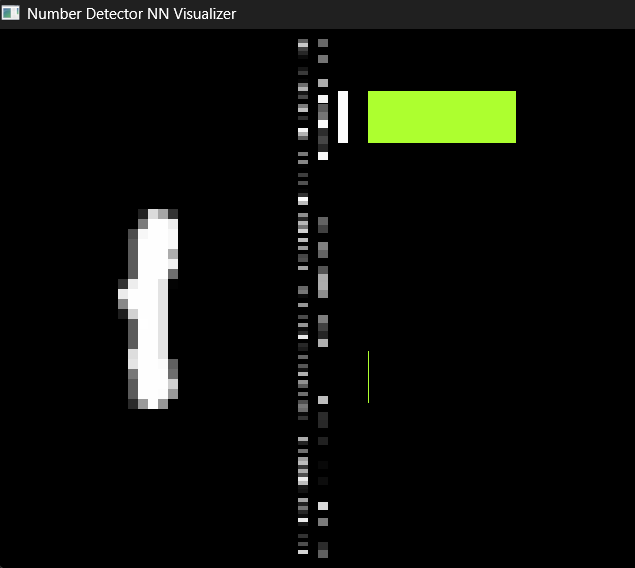

# C++ Digit Recognizer from Scratch 🧠

A fully connected Neural Network implementation in raw C++ to recognize handwritten digits (MNIST dataset).

This project demonstrates the core concepts of Deep Learning—Forward Propagation, Backpropagation, Gradient Descent, and Activation Functions—built entirely from the ground up without using any machine learning libraries. It features a real-time visualization engine built with **SDL3**.

## ✨ Features

- **From Scratch Implementation:** No ML libraries (no PyTorch, TensorFlow, etc.). Just pure C++ math.
- **Real-Time Visualization:**
  - **Input Layer:** See the raw 28x28 pixel input.
  - **Hidden Layers:** Visualizes neuron activations in real-time.
  - **Output Layer:** Dynamic "Confidence Meter" bars showing the network's probability distribution.
- **Optimized Learning:**
  - Xavier/Glorot Initialization for weight stability.
  - ReLU Activation for hidden layers.
  - Softmax Output with Cross-Entropy Loss.
  - Input Normalization.

## 🛠️ Technologies Used

- **Language:** C++ (Standard 17 or later recommended)
- **Graphics:** [SDL3](https://wiki.libsdl.org/SDL3/FrontPage) (Simple DirectMedia Layer)
- **Dataset:** [MNIST Database of Handwritten Digits](http://yann.lecun.com/exdb/mnist/)

## 📸 Screenshots



## 🚀 Getting Started

### Prerequisites

- C++ Compiler (GCC, Clang, or MSVC)
- SDL3 Development Libraries

### Installation

1.  **Clone the repository:**

    ```bash
    git clone [https://github.com/DEVELOPERX-coder/Number-Detector.git](https://github.com/DEVELOPERX-coder/Number-Detector.git)
    cd Number-Detector
    ```

2.  **Download the Dataset:**

    - Download the MNIST dataset files (train-images, train-labels, t10k-images, t10k-labels).
    - Place them in a folder named `MNIST/` in the project root.

3.  **Build the project:**
    _(Example command - adjust based on your setup)_
    ```bash
    g++ main.cpp -Iinclude -Llib -lSDL3 -lSDL3_image
    ```

### 🎮 Controls

- **Q:** Quit the application.

## 🧠 How It Works

The network consists of an input layer (784 nodes), two hidden layers (128 and 64 nodes), and an output layer (10 nodes). It uses **Stochastic Gradient Descent (SGD)** to minimize the error between its prediction and the actual label.

- **Forward Pass:** Pixels -> Weights -> ReLU -> Weights -> Softmax.
- **Backward Pass:** Error calculation -> Derivative of Activation -> Weight Update.

## 📝 License

This project is open source and available under the [MIT License](LICENSE).
